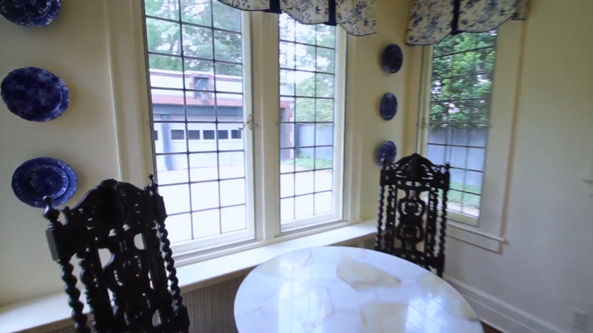
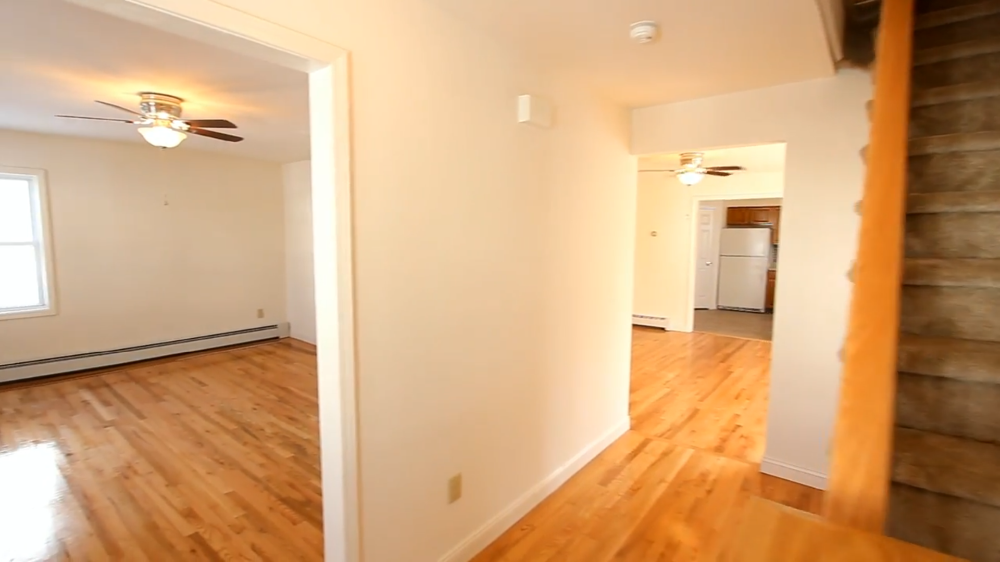
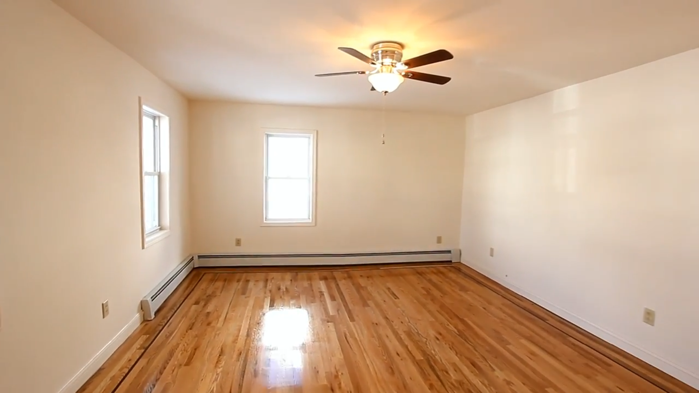
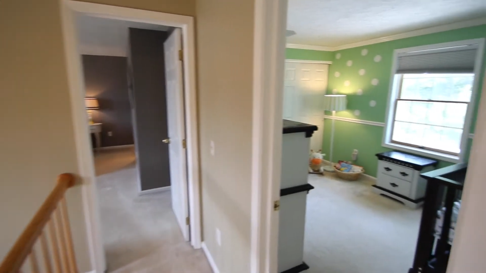
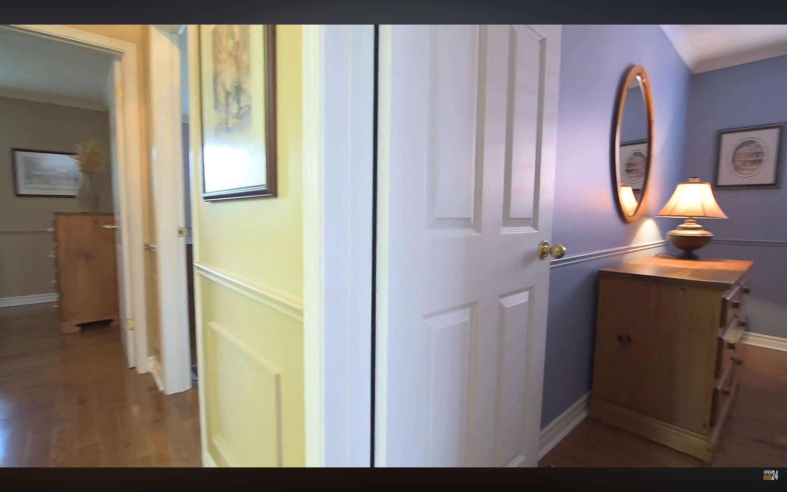

# Human Failure Case Analysis

This page provides three representative examples of incorrect human responses for **two-agent** and **three-agent egocentric-motion** questions. These examples were manually inspected in response to reviewer comments regarding whether human failures arise from ambiguous questions or from the difficulty of multi-step spatial reasoning.

Each example contains the original agent views, the task presented to the annotators, the human responses, and a concise explanation of why the correct answer is uniquely determined.

---
# Two Agent Samples

# Example 1

## Agent Views

  
  

**Agent 1** (left) &nbsp;&nbsp;&nbsp; **Agent 2** (right)

## Task

**Motion:** Agent 2 moves **backwards**.

**Question:** How should the motion be interpreted in **Agent 1's** local reference frame?

### Choices

- A. North
- B. East
- C. West
- D. South
### Human Response

**Prediction:** South
**Ground Truth:** **South**

## Required Spatial Reasoning

1. Determine Agent 2's approximate orientation relative to Agent 1
2. Interpret Agent 2's backward motion in its local frame
3. Transform this translation into Agent 1's egocentric coordinate system

---

# Example 2

## Agent Views

  
  

**Agent 1** (left) &nbsp;&nbsp;&nbsp; **Agent 2** (right)

## Task

**Motion:** Agent 1 turns **45° counterclockwise** and subsequently moves **forward**.

**Question:** How should the latter translational motion be interpreted in **Agent 2's** local reference frame?

### Choices

- A. North
- B. East
- C. West
- D. South
### Human Response

**Prediction:** North
**Ground Truth:** **North**

## Required Spatial Reasoning

1. Determine Agent 2's approximate orientation relative to Agent 1
2. Apply the specified 45° CCW rotation to Agent 1's local coordinate frame
3. Interpret Agent 1's subsequent forward motion in its local frame
4. Transform this translation into Agent 2's egocentric coordinate system

---

# Example 3

## Agent Views

  
  

**Agent 1** (left) &nbsp;&nbsp;&nbsp; **Agent 2** (right)

## Task

**Motion:** Agent 2 turns **90° clockwise**

**Question:** After rotating, what direction will Agent 2 be facing towards in Agent 1's local frame?

### Choices

- A. North
- B. East
- C. West
- D. South
### Human Response

**Prediction:** North
**Ground Truth:** **North**

## Required Spatial Reasoning

1. Determine Agent 2's approximate orientation relative to Agent 1
2. Apply the specified 90° CW rotation to Agent 2's local coordinate frame
3. Reinterpret Agent 2's updated local frame with respect to Agent 1's egocentric coordinate system

---
# Three Agent Samples

# Example 1

## Agent Views

  
  
  

**Agent 1** (left) &nbsp;&nbsp;&nbsp; **Agent 2** (center) &nbsp;&nbsp;&nbsp; **Agent 3** (right)

## Task

**Motion:** Agent 3 turns **90° clockwise** and then **moves to its right**.

**Question:** How should the latter translational motion be interpreted in **Agent 2's** local reference frame?

### Choices

- A. North
- B. East
- C. West
- D. South

### Human Responses

| Annotator | Response |
|-----------|----------|
| Human 1 | South |
| Human 2 | South |
| Human 3 | South |

**Ground Truth:** **East**

## Required Spatial Reasoning

1. Determine Agent 2's approximate orientation relative to Agent 1
2. Determine Agent 3's approximate orientation relative to Agent 1
3. Use the above information to determine Agent 3's approximate orientation relative to Agent 2
4. Apply the specified 90° clockwise rotation to Agent 3's local coordinate frame.
5. Interpret Agent 3's subsequent rightward translation in its updated local frame.
6. Transform this translation into Agent 2's egocentric coordinate system.

---

# Example 2

## Agent Views

  
  
  

**Agent 1** (left) &nbsp;&nbsp;&nbsp; **Agent 2** (center) &nbsp;&nbsp;&nbsp; **Agent 3** (right)

## Task

**Motion:** Agent 3 moves **backward**.

**Question:** How should this motion be interpreted in **Agent 1's** local reference frame?

### Choices

- A. North
- B. East
- C. West
- D. South

### Human Response

**Prediction:** North

**Ground Truth:** **West**

## Required Spatial Reasoning

1. Determine Agent 3's approximate orientation relative to Agent 2
2. Determine Agent 1's approximate orientation relative to Agent 2
3. Use the above information to determine Agent 3's approximate orientation relative to Agent 1
4. Express Agent 3's backward motion in its own local coordinate system.
5. Transform this motion into Agent 1's egocentric reference frame.

---

# Example 3

## Agent Views

  
  
  

**Agent 1** (left) &nbsp;&nbsp;&nbsp; **Agent 2** (center) &nbsp;&nbsp;&nbsp; **Agent 3** (right)

## Task

**Question ID:** 2514

**Motion:** Agent 3 moves **backward**.

**Question:** How should this motion be interpreted in **Agent 2's** local reference frame?

### Choices

- A. North
- B. East
- C. West
- D. South

### Human Response

**Prediction:** South

**Ground Truth:** **East**

## Required Spatial Reasoning

1. Determine Agent 2's approximate orientation relative to Agent 1
2. Determine Agent 3's approximate orientation relative to Agent 1
3. Using the above, determine Agent 2's approximate orientation relative to Agent 3
4. Represent Agent 3's backward motion in its local frame.
5. Transform this motion into Agent 2's egocentric coordinate system.
---

# Summary

The examples above illustrate a clear qualitative distinction between representative two-agent and three-agent egocentric-motion questions. Although all questions admit a deterministic solution procedure, increasing the number of participating agents substantially increases the number of reference-frame transformations that must be composed before the final answer can be determined.

The representative two-agent examples require only three to four sequential reasoning operations. In contrast, the representative three-agent examples require five to six sequential reasoning operations, including inferring relative orientations through intermediate reference frames before expressing the specified motion in the target agent's local coordinate system. This substantially lengthens the reasoning chain and introduces additional opportunities for error, as an incorrect intermediate transformation propagates through the remainder of the solution.

Importantly, these examples do not suggest that the benchmark questions are ambiguous or require subjective interpretation of the scene geometry. Instead, each question follows a systematic sequence of coordinate transformations whose individual steps are uniquely determined by the observed scene geometry and the specified motion. The primary challenge for human evaluators is therefore not determining whether the scene admits a unique solution, but accurately composing multiple egocentric reference-frame transformations whose relationships must first be inferred from cross-view correspondences.
