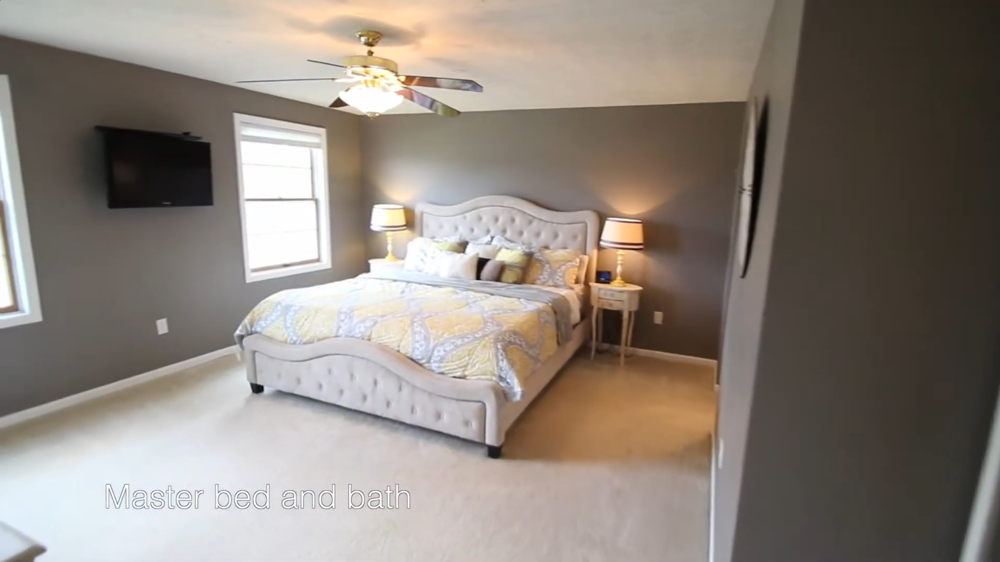
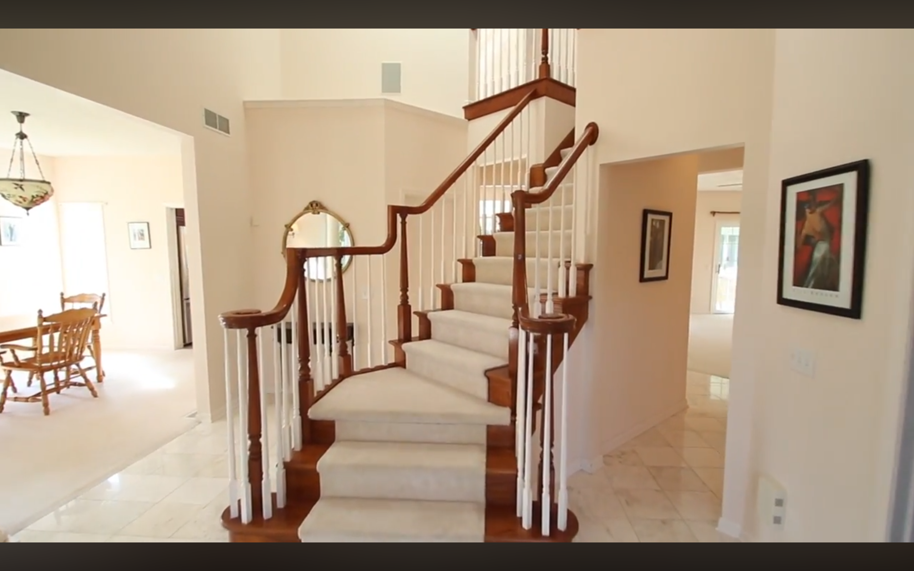
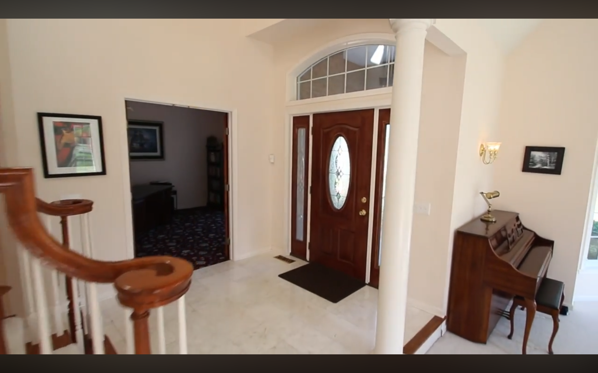
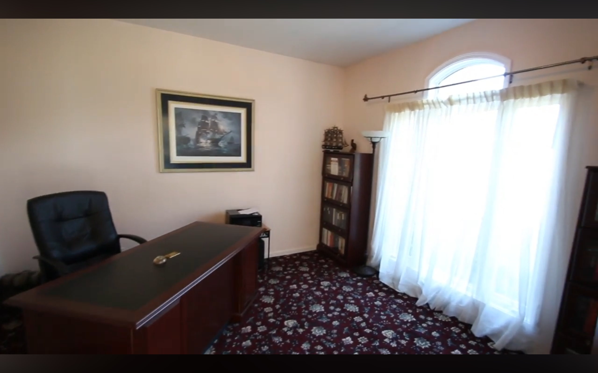
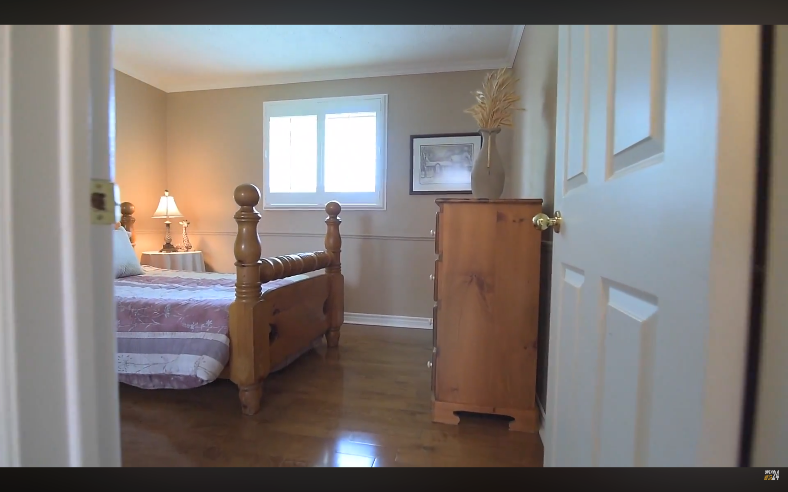

# Human Failure Case Analysis

This page provides three representative examples of incorrect human responses on **three-agent egocentric-motion** questions. These examples were manually inspected in response to reviewer comments regarding whether human failures arise from ambiguous questions or from the difficulty of multi-step spatial reasoning.

Each example contains the original agent views, the task presented to the annotators, the human responses, and a concise explanation of why the correct answer is uniquely determined.

---

# Example 1

## Agent Views

  
  
  

**Agent 1** (left) &nbsp;&nbsp;&nbsp; **Agent 2** (center) &nbsp;&nbsp;&nbsp; **Agent 3** (right)

## Task

**Question ID:** 2592

**Motion:** Agent 3 turns **90° clockwise** and then **moves to its right**.

**Question:** How should this final translational motion be interpreted in **Agent 2's** local reference frame?

### Choices

- A. North
- B. East
- C. West
- D. South

### Human Responses

| Annotator | Response |
|-----------|----------|
| Human 1 | South |
| Human 2 | South |
| Human 3 | South |

**Ground Truth:** **East**

## Required Spatial Reasoning

1. Determine Agent 3's orientation relative to Agent 2 from the observed scene geometry.
2. Apply the specified 90° clockwise rotation to Agent 3's local coordinate frame.
3. Interpret Agent 3's subsequent rightward translation in its updated local frame.
4. Transform this translation into Agent 2's egocentric coordinate system.
5. The resulting direction is **East**.

## Discussion

All three independent annotators selected the same incorrect answer (**South**) despite four possible choices. Rather than exhibiting disagreement characteristic of ambiguous or underspecified questions, the responses converged on the same distractor, suggesting a shared but incorrect interpretation of the required reference-frame transformations.

---

# Example 2

## Agent Views

  
  
  

**Agent 1** (left) &nbsp;&nbsp;&nbsp; **Agent 2** (center) &nbsp;&nbsp;&nbsp; **Agent 3** (right)

## Task

**Question ID:** 2503

**Motion:** Agent 3 moves **backward**.

**Question:** How should this motion be interpreted in **Agent 1's** local reference frame?

### Choices

- A. North
- B. East
- C. West
- D. South

### Human Response

**Prediction:** North

**Ground Truth:** **West**

## Required Spatial Reasoning

1. Infer the relative orientation between Agent 3 and Agent 1.
2. Express Agent 3's backward motion in its own local coordinate system.
3. Transform this motion into Agent 1's egocentric reference frame.
4. The resulting direction is **West**.

## Discussion

This question requires composing a reference-frame transformation across two viewpoints. Once the relative orientations are established, the answer follows deterministically from the specified motion.

---

# Example 3

## Agent Views

  
  
  

**Agent 1** (left) &nbsp;&nbsp;&nbsp; **Agent 2** (center) &nbsp;&nbsp;&nbsp; **Agent 3** (right)

## Task

**Question ID:** 2514

**Motion:** Agent 3 moves **backward**.

**Question:** How should this motion be interpreted in **Agent 2's** local reference frame?

### Choices

- A. North
- B. East
- C. West
- D. South

### Human Response

**Prediction:** South

**Ground Truth:** **East**

## Required Spatial Reasoning

1. Determine the relative orientations of Agent 2 and Agent 3.
2. Represent Agent 3's backward motion in its local frame.
3. Transform this motion into Agent 2's egocentric coordinate system.
4. The resulting direction is **East**.

## Discussion

Although this example requires fewer reasoning steps than Example 1, it still depends on correctly composing the agents' local coordinate systems. The answer is uniquely determined by the scene geometry and specified motion.

---

# Summary

These examples were selected because they are representative of the observed human failures on three-agent egocentric-motion questions. In all three cases, the correct answer follows from a deterministic sequence of reference-frame transformations once the relative agent orientations are established. We did not observe evidence that the correct answer depends on subjective interpretation of the scene geometry. Notably, Example 1 demonstrates that all three annotators independently converged on the same incorrect answer, which is more consistent with a systematic reasoning error than with random guessing on an ambiguous question.
