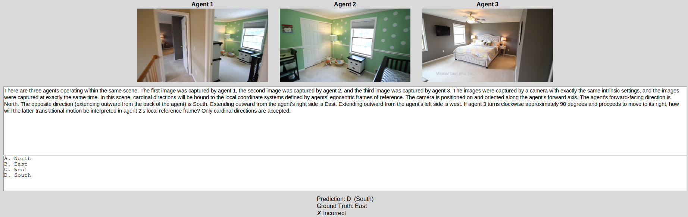
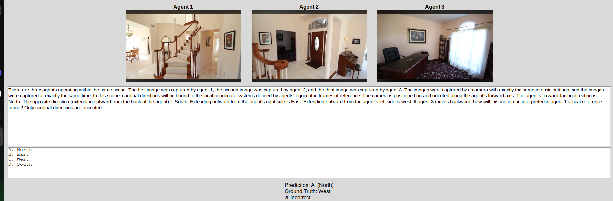
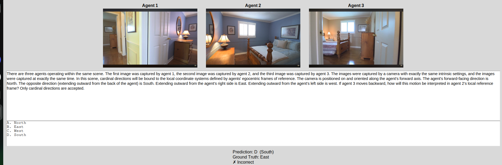

# Human Failure Case Analysis

This page provides representative examples of human errors on **three-agent egocentric-motion** questions in response to reviewer comments regarding the human evaluation.

The goal is to illustrate the nature of these failures. For each example, we include the original question, the human predictions, the correct answer, and a concise explanation of the spatial reasoning required to solve the problem.

---

# Example 1

  

## Question

> *Paste the full question here.*

## Human Responses

| Annotator | Response |
|-----------|----------|
| Human 1 | South |
| Human 2 | South |
| Human 3 | South |

**Ground Truth:** **East**

## Required Spatial Reasoning

1. TODO
2. TODO
3. TODO
4. TODO

## Discussion

*Describe why the answer is uniquely determined and why this appears to be a systematic reasoning error rather than an ambiguous question.*

---

# Example 2

  

## Question

> *Paste the full question here.*

## Human Responses

| Annotator | Response |
|-----------|----------|
| Human 1 | TODO |

**Ground Truth:** **TODO**

## Required Spatial Reasoning

1. TODO
2. TODO
3. TODO
4. TODO

## Discussion

*Describe the reasoning process required to solve the question and why the incorrect prediction is understandable but not due to ambiguity.*

---

# Example 3

  

## Question

> *Paste the full question here.*

## Human Responses

| Annotator | Response |
|-----------|----------|
| Human 1 | TODO |

**Ground Truth:** **TODO**

## Required Spatial Reasoning

1. TODO
2. TODO
3. TODO
4. TODO

## Discussion

*Describe the reasoning process required to solve the question and why the answer is uniquely determined.*

---

# Summary

Across the inspected failures, we did not observe evidence that the correct answer depended on subjective interpretation of the scene. Instead, these examples require composing multiple reference-frame transformations across three viewpoints. The resulting errors are consistent with the increased reasoning complexity of multi-agent egocentric-motion tasks rather than ambiguity in the benchmark. In particular, Example 1 illustrates that multiple annotators independently converged on the same incorrect answer, suggesting a shared but incorrect reasoning process rather than random guessing.
